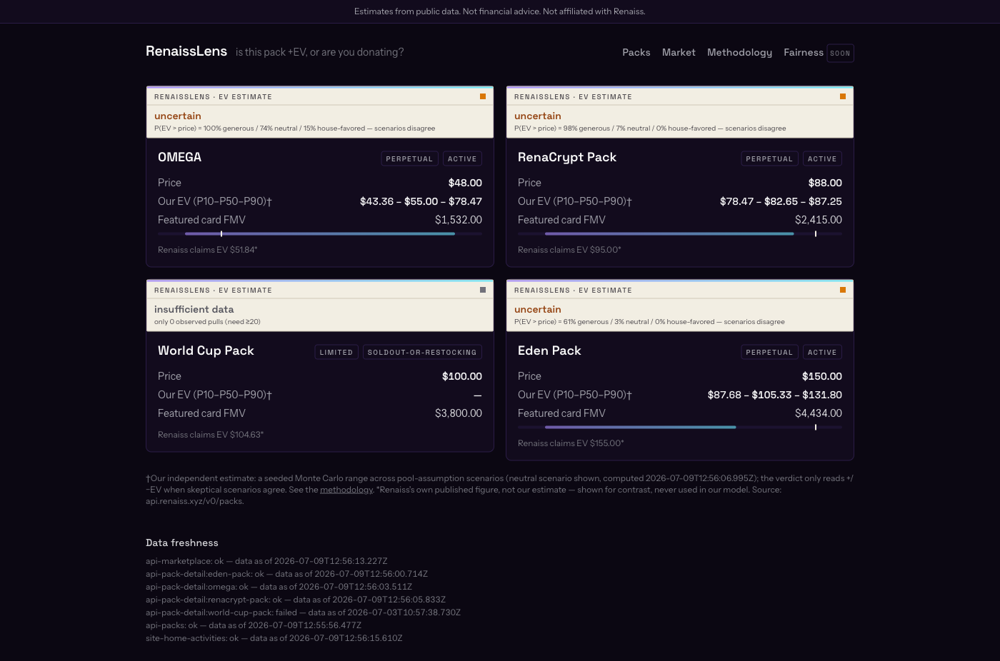
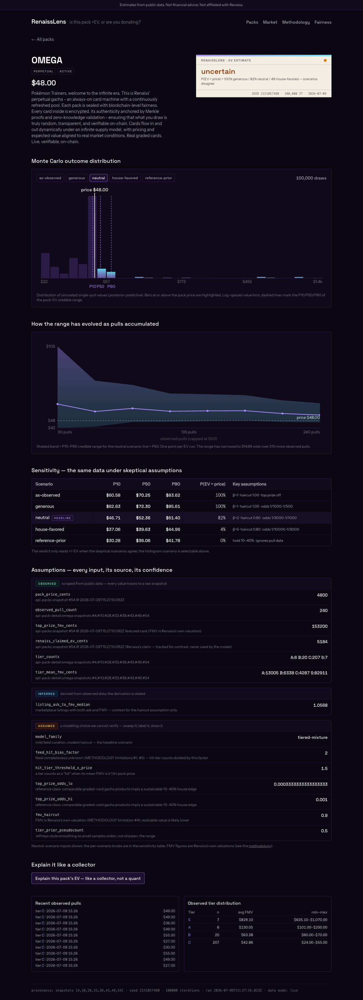
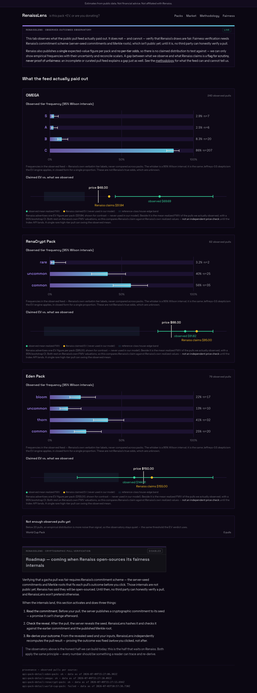
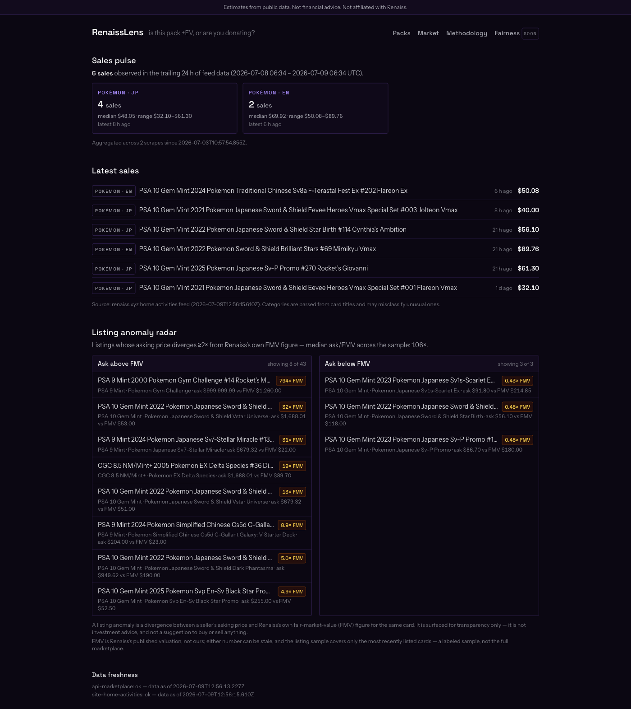

# RenaissLens

> Pack expected-value & market intelligence for [renaiss.xyz](https://www.renaiss.xyz) — know what a pack is worth before you rip it.

**Estimates from public data. Not financial advice. Not affiliated with Renaiss.**

**Live: <https://renaisslens-production.up.railway.app>** · Renaiss Tech Hackathon S1 (Tool track) · [submission notes](SUBMISSION.md)

## Quickstart

```bash
pnpm i && pnpm dev
```

No env vars needed — the dashboard boots offline from committed sample snapshots in `data/snapshots/demo/`. Live data ingestion is opt-in via `pnpm scrape`.

## Scripts

| Command | What it does |
|---|---|
| `pnpm dev` | Migrate DB → load demo snapshots → start the dashboard |
| `pnpm scrape` | One polite live ingestion cycle (Renaiss public API + homepage feed) |
| `pnpm scrape:mock` | Load committed demo snapshots into the DB — zero network |
| `pnpm scrape:watch` | Continuous ingestion loop (packs/feed ~30min, marketplace ~6h) |
| `pnpm ev:run` | Compute EV ranges (all packs × scenarios) from current DB state — zero network |
| `pnpm test` | Unit tests (money conversion, parsers, loaders, EV engine round-trips, RNG determinism) |
| `pnpm lint` / `pnpm typecheck` | Biome + `tsc --noEmit` |
| `pnpm db:migrate` / `pnpm db:reset` | Apply migrations / wipe + rebuild from demo snapshots |

## AI explainer (optional)

Every pack page has an "explain it like a collector" button powered by the Claude API. It is
strictly optional: without an `ANTHROPIC_API_KEY` in the environment the button doesn't render
and `POST /api/explain` returns a friendly 503 — the keyless demo is unaffected. The model only
receives the numbers already shown on the page (never a single-point EV), must label
assumptions, refuses buy/sell advice, and its output always ends with a not-financial-advice
caveat that the server enforces. Repeat clicks are served from an in-memory cache until the next
EV run changes the data.

The explainer speaks the Anthropic API protocol, so it works against Anthropic (default) or any
compatible provider. Configure with three env vars: `ANTHROPIC_API_KEY` (the endpoint's key),
`RENAISSLENS_EXPLAINER_MODEL` (default `claude-opus-4-8`), and `RENAISSLENS_EXPLAINER_BASE_URL`
(default Anthropic). For example, to use Xiaomi MiMo: model `mimo-v2.5-pro`, base URL
`https://token-plan-sgp.xiaomimimo.com/anthropic`.

## Screenshots

Live deployment, real data — every metric carries its own scrape timestamp.

| | |
|---|---|
| **Packs** — one verdict per pack, EV always a range |  |
| **Pack detail** — Monte Carlo histogram, a confidence-over-time curve (the EV range narrowing as pulls accumulate), sensitivity ladder, labeled assumptions |  |
| **Fairness observatory** — observed per-tier pull frequencies with Wilson confidence intervals + a claimed-EV-vs-observed reconciliation (observes outcomes, verifies nothing it can't) |  |
| **Market** — sales pulse, categorized feed, two-sided listing-anomaly radar |  |

## Demo video

_**TODO: link goes here before submission.**_

## Deployment

The live instance runs on [Railway](https://railway.com) from the committed
[`Dockerfile`](Dockerfile) (config in [`railway.json`](railway.json)):

- **Full-monorepo image** — the app resolves every path from the workspace root, so the
  container ships the whole workspace and runs it the same way `pnpm dev` does.
- **Persistent volume at `/app/data`** — SQLite + snapshots survive redeploys. On a fresh
  volume the entrypoint seeds the committed demo snapshots from an image bake, so the
  dashboard is populated before the first live scrape completes.
- **One container, two processes** — [`docker/entrypoint.sh`](docker/entrypoint.sh) starts the
  polite ingestion watch loop in the background under a restart supervisor (a scraper crash
  never takes the site down) and runs the web server in the foreground behind a
  [`/api/health`](https://renaisslens-production.up.railway.app/api/health) readiness gate.
- **Single replica on purpose** — SQLite has one writer; the in-memory explainer cache and
  rate limiter assume one process.
- Judging-week uptime is watched by a [15-minute canary](.github/workflows/uptime.yml).

Deploying your own: `railway init && railway volume add --mount-path /app/data && railway up`.
No env vars required; set the three explainer vars from [.env.example](.env.example) if you
want the AI explainer.

## Data sources

| Source | What | Method | Cadence | Politeness |
|---|---|---|---|---|
| `api.renaiss.xyz` (public, no auth) | Packs, pack pull feed, marketplace listings | REST poll | 30 min / 6 h | ≥2s between requests, identified UA, backoff |
| `www.renaiss.xyz` homepage | "Latest Activities" sales feed | Server-rendered HTML fetch (Playwright fallback) | 30 min | Single page per cycle, identified UA |
| Renaiss OS Index API (`api.renaissos.com`) | Independent cross-marketplace reference prices (cross-checked vs FMV) | Keyed REST (`X-Api-Key`/`X-Api-Secret`), exact-match by card identity | Daily | Partner key, 10k/day, ≥2s spacing, attributed |

Every stored record traces back to a raw snapshot on disk with a timestamp; every displayed metric carries its source and scrape time. See [METHODOLOGY.md](METHODOLOGY.md).

## Architecture

```
packages/scraper ──▶ SQLite (packages/db) ──▶ apps/web (Next.js dashboard)
                          ▲
packages/ev-engine ───────┘  (pure TS Monte Carlo, seeded RNG, zero runtime deps)
data/snapshots/           raw + parsed snapshot store (demo set committed)
```

## Safety & disclaimers

- **Not financial advice.** EV figures are estimates shown as ranges with labeled assumptions (see [METHODOLOGY.md](METHODOLOGY.md)).
- **No wallet code, no private keys, no transaction signing.** This repo reads public data only; the API client is structurally incapable of calling write endpoints.
- **No accounts, no cookies, no tracking.**
- **No secrets required.** Every env var is optional (see [.env.example](.env.example)); vars are read from the shell environment — no `.env` loader is bundled.
- **Polite scraping:** identified `RenaissLens-Hackathon/1.0` User-Agent, one global serial request queue with ≥2s spacing, capped exponential backoff honoring `Retry-After`, ~9 requests per cycle on explicit cadences, and a byte-exact snapshot store so development replays committed data instead of re-fetching.

## License

MIT
